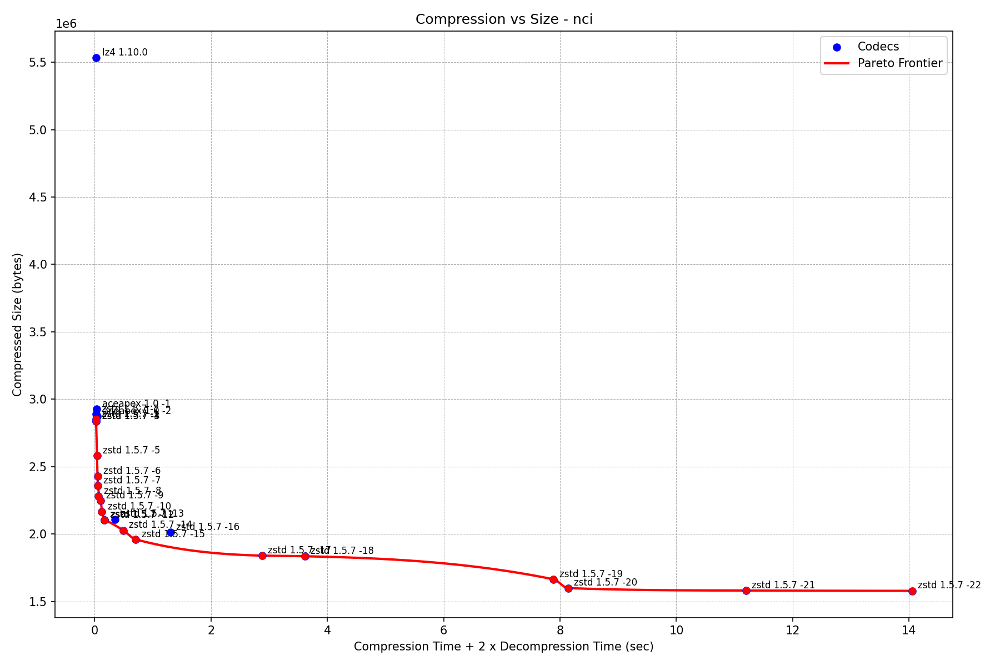
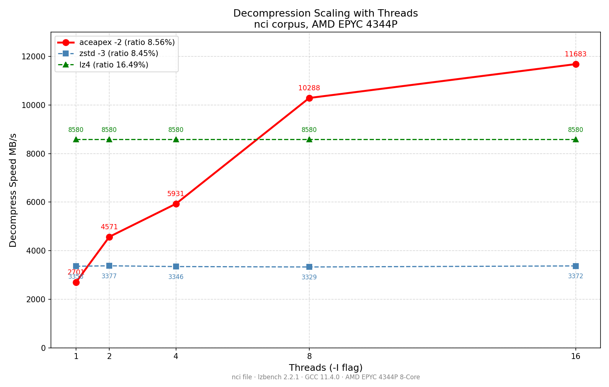

# ACEAPEX

## Benchmarks (lzbench, AMD EPYC 4344P, file: nci)

### Single-thread (I=1)

| Compressor | Compress | Decompress | Ratio |
|------------|----------|------------|-------|
| aceapex -1 | 238 MB/s | 2544 MB/s | 8.72% |
| aceapex -2 | 150 MB/s | 2574 MB/s | 8.56% |
| lz4 1.10.0 | 1767 MB/s | 8629 MB/s | 16.49% |
| zstd -3    | 1096 MB/s | 3367 MB/s | 8.45% |

### Multi-thread (I=8)

| Compressor | Compress | Decompress | Ratio |
|------------|----------|------------|-------|
| aceapex -1 | 1210 MB/s | **9714 MB/s** | 8.72% |
| aceapex -2 | 862 MB/s | **10192 MB/s** | 8.56% |
| lz4 1.10.0 | 1771 MB/s | 8733 MB/s | 16.49% |
| zstd -3    | 3083 MB/s | 3397 MB/s | 8.45% |

ACEAPEX decode scales with threads — lz4/zstd do not.

> Note: All codecs tested with same `-I8` flag (parallel independent instances). lz4/zstd have their own multi-thread compress APIs not reflected here.

## Multi-Platform Results (FASTQ NA12878, 1GB, bit-perfect)

| Platform | Threads | Compressor | Decompress | Ratio |
|----------|---------|------------|------------|-------|
| EPYC 4344P (DDR5 16.9 GB/s) | I=8 | aceapex -2 | **6,300 MB/s** | 7.75% |
| EPYC 4344P (DDR5 16.9 GB/s) | I=8 | zstd -3 | 3,852 MB/s | 7.57% |
| EPYC 9575F (DDR5 47 GB/s) | I=32 | aceapex -2 | **9,903 MB/s** | 7.75% |
| EPYC 9575F (DDR5 47 GB/s) | I=32 | zstd -3 | 3,938 MB/s | 7.57% |

aceapex consistently **2.2–2.5x faster** than zstd across platforms.

zstd decode does not scale past I=8. aceapex scales to I=32 via independent block architecture.

## Performance Graph

*Graph generated with hexagone's lzbench visualization script. X: compression time + 2x decompression time. Y: compressed size.*

## Decode Scaling

ACEAPEX resolves all cross-block references at encode time. Each block decodes independently — no inter-block dependencies. zstd and lz4 cannot parallelize decode without format changes.

## Status

✅ **Included in [lzbench](https://github.com/inikep/lzbench)** — PR #276 + PR #277 merged May 2026.

Lossless compression with parallel block decode.

## lzbench results (in-memory, AMD EPYC 4344P)

| Compressor     | Threads | Compress  | Decompress | Ratio  | File    |
|----------------|---------|-----------|------------|--------|---------|
| zstd -3        | 1       | 1096 MB/s | 3363 MB/s  | 8.45%  | nci     |
| zstd -3        | 8       | 3083 MB/s | 3397 MB/s  | 8.45%  | nci     |
| aceapex -2     | 1       |  150 MB/s | 2574 MB/s  | 8.56%  | nci     |
| aceapex -2     | 8       |  862 MB/s | 10192 MB/s | 8.56%  | nci     |
| zstd -3        | 1       |  856 MB/s | 3293 MB/s  | 11.90% | xml     |
| zstd -3        | 8       |  812 MB/s | 3309 MB/s  | 11.90% | xml     |
| aceapex -2     | 1       |  162 MB/s | 2800 MB/s  | 12.93% | xml     |
| aceapex -2     | 8       |  876 MB/s | 4697 MB/s  | 12.93% | xml     |
| zstd -3        | 1       |  261 MB/s | 1578 MB/s  | 35.96% | dickens |
| zstd -3        | 8       |  324 MB/s | 1592 MB/s  | 35.96% | dickens |
| aceapex -2     | 1       |   74 MB/s | 1600 MB/s  | 38.44% | dickens |
| aceapex -2     | 8       |  205 MB/s | 4080 MB/s  | 38.44% | dickens |

All BIT-PERFECT (MD5 verified).

*Thanks to flanglet and the lzbench community for methodology feedback.*

## Documentation

[📄 Technical Whitepaper](docs/WHITEPAPER.md) — architecture, design decisions, benchmarks, limitations.

## Core Idea

Standard LZ77 codecs face a tradeoff:
- Global context → better ratio but sequential decode
- Independent blocks → parallel decode but worse ratio

ACEAPEX separates these: global match search at encode,
block-parallel decode via per-block offset index in header.

## Two formats

**ACEPX2** — maximum throughput, requires ~2.8GB RAM encode  
**ACEPX3** — streaming, 23MB RAM encode, parallel decode

## Build

    sudo apt-get install -y libzstd-dev g++
    git clone https://github.com/yasha1971-coder/aceapex
    cd aceapex && bash build.sh

## Usage

    ./aceapex c --in myfile --out myfile.acpx --threads 8
    ./aceapex d --in myfile.acpx --out myfile_restored

## Honest Status

Research-grade. Single-thread decode slower than zstd.
Multi-thread decode 3x faster than zstd on structured data.
Encode 7x slower than zstd single-thread.
Built with Claude AI assistance.

## License

MIT
