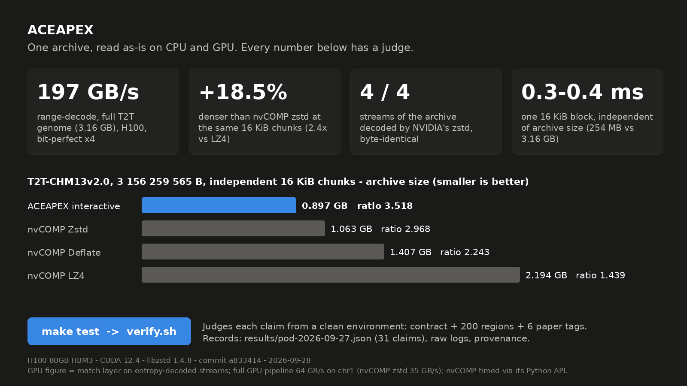

# ACEAPEX

**A parallel LZ77 codec that resolves every back-reference to an absolute position at encode time — so any region decodes on the GPU without touching the rest of the file.**

Full device-resident GPU decode pipeline. Position-invariant random access on genomic data.

[](https://github.com/yasha1971-coder/aceapex/actions/workflows/ci.yml)
[](https://github.com/inikep/lzbench/releases/tag/v2.4)
[](LICENSE)
[](#papers)
[](https://doi.org/10.5281/zenodo.23061934)



**Every number on that card has a judge. One command runs them all:**

    make test && ./verify.sh

Judges the contract, 200 random regions and all 6 paper tags from a clean environment;
writes `results/<tag>.json` with provenance (host, cores, libzstd, compiler) and prints
pass / fail / known-deviation per claim. GPU claims need an H100 + nvCOMP 5.3;
without one they are marked `skipped-gpu`, never `pass`.
Encode is CPU-only, one pass: chr1 (254 MB) in 0.94 s on 8 threads = 270 MB/s, peak RSS 0.87 GB; archive bytes do not depend on thread count (ace-core, libzstd 1.4.8).
Consumer-class GPU: Tesla T4 (Colab, CUDA 12.8, libzstd 1.5.5) decodes chr1 at 25.9 GB/s, bit-perfect, 7-run median; make test there: 21 pass / 0 fail. Log: [results/colab-t4-2026-09-28.log](results/colab-t4-2026-09-28.log).
Full GPU path on the archive as written, one process (nvCOMP zstd + unpack kernels + match kernel, G chosen by a probe), T4: 27.8 ms on-device for chr1 = 9.1 GB/s, 33.4 ms with H2D = 7.6 GB/s delivered, bit-perfect; harness `aceapex_gpu.cu`.
Pod-day record: [`results/pod-2026-09-27.json`](results/pod-2026-09-27.json) (31 claims), raw log, [decisions](docs/DECISIONS.md).
Details: [Verify every published number](#verify-every-published-number).

**Embedding.** The whole decoder is [`c/aceapex_decode.c`](c/aceapex_decode.c): 261 lines of C99, libzstd the only
dependency, region and batch API with the names of [`src/aceapex.h`](src/aceapex.h); `make axdec libaceapex_decode.so`.
The format is specified in [`docs/FORMAT_ACEPX2.md`](docs/FORMAT_ACEPX2.md) and pinned by the conformance fixtures in
[`verify/fixtures/`](verify/fixtures/) (14 archives + cross-libzstd + empty), which `make test` judges for both decoders.
Python: `pip install ./python` (needs libzstd-dev), then `aceapex.open("x.aet").read(offset, length)` or `.ranges([...])`.
GPU: [`aceapex_gpu.cu`](aceapex_gpu.cu) reads the same archive on the device through nvCOMP's zstd, two unpack kernels and the match kernel.

Measured against bgzip and zstd-seekable on the same operation, nine axes, every answer verified
byte for byte: [hw-apex-bench](https://yasha1971-coder.github.io/hw-apex-bench/). ACEAPEX does not
lead every column there, and the ones it loses are printed as they came out.

**Every published claim is answered with a number and a way to check it — see [CLAIMS.md](CLAIMS.md).**

```bash
git clone https://github.com/yasha1971-coder/aceapex.git && cd aceapex
sudo apt-get install -y libzstd-dev g++
g++ -O3 -march=native -funroll-loops -std=c++17 \
    -o aceapex src/aceapex_main.cpp -lpthread -lzstd
./aceapex c --in myfile --out myfile.aet --threads 8
```

---

## What this is

ACEAPEX is a research-grade LZ77 codec built around one design decision: **match search never leaves the current block**. That makes every block self-contained and independently decodable, which unlocks parallel decode on CPU and GPU and **position-invariant random access** — decoding an arbitrary region without decompressing the whole file. Inside a block, the encoder additionally redirects explicit references to their earlier originating position where the substitution validates byte for byte, shortening dependency chains; the rest is resolved by the decoder.

It is not the densest compressor (see [Honest Status](#honest-status)). Its edge is **decode speed, region seek, and GPU residency** — useful when large static datasets are read far more often than written: genomic archives, columnar stores, GPU data-loading pipelines.

---

## Core Idea

Standard LZ77 codecs face a tradeoff:

- Global context gives better ratio but forces sequential decode
- Independent blocks enable parallel decode but lose ratio

ACEAPEX takes the second branch and works on the price of it:

- **Encode:** match search is confined to the block, so a block never references outside itself; where it can be validated byte for byte, an explicit reference is additionally **redirected to the earlier originating position**, shortening the dependency chain inside the block
- **Decode:** block-parallel reconstruction — each block is self-contained and independently decodable

Two separate mechanisms, not one. Confining the search is what removes cross-block dependency and makes a block independently decodable; flattening only shortens dependency chains inside a block, and what remains is handled by the decoder — by wavefront ordering, or in closed form where a match is a periodic fill. The price is paid in ratio, and we state it: under an equal 16 KB independent-block constraint the match layer recovers about three quarters of what blocking costs (see [CLAIMS.md](CLAIMS.md)).

---

## lzbench 2.3 / 2.4

ACEAPEX (CPU) and `aceapex_cuda` (GPU) are included in the [official lzbench 2.3 release](https://github.com/inikep/lzbench/releases/tag/v2.3) and carried as `aceapex 1.0.1` in [lzbench 2.4](https://github.com/inikep/lzbench/releases/tag/v2.4) (format 1 line; this repository is format 2, see CHANGELOG.md) — third-party validation by construction. GPU decoders for LZ77-family formats have been in lzbench since nvcomp's LZ4 and GDeflate; what `aceapex_cuda` adds is a GPU decode path for a format with absolute offsets and position-invariant random access.

ACEAPEX is also part of [TurboBench](https://github.com/powturbo/TurboBench) since v2.2.1 ([PR #57](https://github.com/powturbo/TurboBench/pull/57)).

---

## Benchmarks

### CPU (lzbench 2.3, host-to-host, decompress MB/s)

| Dataset | CPU 1-thread | aceapex_cuda | CPU -T8 |
|---------|-------------|--------------|---------|
| FASTQ 1 GB (ERR194147) | 1,624 | 4,373* | 7,401 |
| enwik9 1 GB | 655 | 1,463 | 5,109 |
| silesia | 803 | 1,403 | 5,594 |

All results XXH3 bit-perfect verified.

*The FASTQ row was re-measured on ENA accession ERR194147 (md5 9af9ffaa0e15dba938408a711740e101);
the previously published figures (1,840 / 13,363 MB/s) came from a local sample with degenerate
quality strings. At ratio 3.98 versus zstd -3 at 3.96 on the same file, ACEAPEX -T8 decodes at
7,401 MB/s against zstd -3 at 2,026 MB/s: 3.65x faster at genuinely comparable ratio.
(*aceapex_cuda row not yet re-measured on the corrected file.)

### GPU — open profile on five GPUs (chr1, no zstd, no nvCOMP call)

chr1 (253 935 557 B), open profile with 16 KiB blocks and 64 KiB literal chunks, archive 67 975 888 B
(the matcher before ADR-020); `aceapex_gpu`, one process, median of 3-7, every row bit-perfect (FNV of the
GPU output == the original). Logs: `results/colab-2026-09-2*-<gpu>-gpu-open.log`, `results/gpu-open-table.md`.

| GPU | on-device, ms | on-device GB/s | + H2D, ms | H2D GB/s (pinned) |
|---|---|---|---|---|
| Tesla T4 (sm_75) | 20.51 | 12.4 | 25.94 | 12.3 |
| L4 (sm_89) | 10.14 | 25.0 | 15.57 | 12.3 |
| A100-SXM4-40GB (sm_80) | 6.17 | 41.2 | 11.59 | 12.3 |
| A100-SXM4-80GB (sm_80) | 6.09 | 41.7 | — | 12.4 |
| RTX PRO 6000 Blackwell SE (sm_120) | 3.69 | 68.8 | 4.87 | 56.6 |

With the l1 encoder (ADR-020, the DNA default since 2026-09-30) the same profile is 63 083 287 B and decodes
on the Blackwell in 2.82 ms on-device (90.1 GB/s, -23 %); T2T (3.16 GB) 27.13 ms against 26.67 (+1.8 %),
31.1 ms with H2D through the stream pipeline.

**How far from the limit** (the same runs; chr1 unless noted):

| GPU | H2D: measured / link peak | output rate / memory bandwidth | ratio / zstd -19 --long=27 |
|---|---|---|---|
| Tesla T4 | 12.3 / 15.8 GB/s (PCIe 3 x16) = 78 % | 12.4 / 320 GB/s = 3.9 % | |
| L4 | 12.3 / 31.5 (PCIe 4 x16) = 39 % | 25.0 / 300 = 8.3 % | |
| A100-SXM4-40GB | 12.3 / 31.5 = 39 % | 41.2 / 1555 = 2.6 % | |
| A100-SXM4-80GB | 12.4 / 31.5 = 39 % | 41.7 / 2039 = 2.0 % (T2T 60.4 = 3.0 %) | |
| RTX PRO 6000 Blackwell | 56.6 / 63.0 (PCIe 5 x16) = 90 % | 68.8 / 1792 = 3.8 % (l1: 90.1 = 5.0 %) | |
| any (archive bytes) | | | default (l1) 4.273x = 103.6 %; open (l1) 4.025x = 97.6 %; open (before l1) 3.736x = 90.6 % |

H2D on the Colab T4/L4/A100 VMs is the host link of the VM (12.3 GB/s on all three), not the GPU. The
memory column counts only the bytes written (the decoded output), a lower bound of the traffic: decode is
bound by the dependent steps of the match and entropy stages, not by memory bandwidth. Ratio reference:
`zstd -19 --long=27 -T16` on chr1 = 61 597 199 B (4.122x, zstd 1.4.8, ace-core, 54 s); ACEAPEX default
59 429 097 B, open profile 63 083 287 B.

### GPU — Full Device-Resident Pipeline (H100 SXM, 16 KB blocks, nvcomp-accelerated, bit-perfect)

| Dataset | Size | GB/s | Ratio |
|---------|------|------|-------|
| ~~FASTQ NA12878 | 1 GB | up to 260 | 11.19~~ | **WITHDRAWN 2026-07-12** |
| FASTQ ERR194147 | 5 GB | 168.9 | 3.31 |
| FASTQ ERR194147 | 50 GB† | 165.7 | 3.99 |

**Correction (2026-07-12):** the 1 GB "NA12878" row above is withdrawn. That local sample had
degenerate quality strings (2 distinct symbols instead of ~40), which inflated its ratio. The
ERR194147 rows are unaffected and were always measured on the real dataset. Re-measured on
ERR194147 (1 GB, md5 9af9ffaa0e15dba938408a711740e101): ratio 3.90 base / 3.97 tuned,
match-phase decode 142.6 / 178.6 GB/s, bit-perfect.

†Range-decode (output size decoupled from VRAM). H2D/D2H excluded from timer: target consumer is GPU-resident.

**Provenance of the two ERR194147 rows:** measured in June 2026 for Paper 2, on the code as it
stood then — before the domain transform, literal chunking and `FSE_CHUNK`. They are a historical
record, not a reading of the current build, and have not been re-measured.

**Two GPU modes:**
- **Mode 1** (nvcomp-free, in lzbench 2.3, ARM-portable): entropy on CPU, match on GPU — ships today, fully open.
- **Mode 2** (nvcomp-accelerated, device-resident): entropy + match both on GPU — performance ceiling, requires proprietary nvcomp.

### Random Access (5 GB genome, 16 KB blocks)

| Operation | Time | Note |
|-----------|------|------|
| Full decode | 29.71 ms | 168 GB/s baseline |
| Seek 1 block (16 KB) | 0.365 ms | point |
| Seek 100 blocks (1.6 MB) | 0.394 ms | region |

Single-block seek is **81× faster** than full decode of the same file. Latency is size-independent — it is dominated by fixed kernel-launch overhead, so seeking 1 block and 100 blocks cost almost the same.

**Against other formats, like for like:** at equal block granularity ACEAPEX reads a single region **1.74–2.57× slower than BGZF**. That comparison, and the eight other axes, are in [hw-apex-bench](https://yasha1971-coder.github.io/hw-apex-bench/). The index goes the other way: read-to-block **40 MB** against a 250 MB `.fai`, and index sizes are comparable because both are files on disk.

> We do not publish a speed ratio against `samtools faidx`. It spawns a process per query while ACEAPEX is a resident library, so such a ratio measures process startup rather than retrieval.

> Boundary: this is read-level access (read id → block), not chr:pos coordinate access. Raw FASTQ precedes alignment; chr:pos belongs to BAM and is future work.

### DietGPU ANS (H100, open-source, standalone)

Meta's open DietGPU ANS: encode **364.9 GB/s**, decode **592.5 GB/s**, bit-perfect. Demonstrates that a fully open replacement for the proprietary entropy stage is viable. Full integration into the ACEAPEX pipeline is future work.

---

## Honest Status

- **Ratio:** ACEAPEX is not best-in-class on ratio. zstd-19 is 1.2–1.55× denser on FASTQ. The position is decode speed + seek + GPU residency at *comparable* ratio, not maximal compression.
- **Mode 2** depends on proprietary nvcomp (closed-source since v2.3). Only Mode 1 is fully open today.
- **Encode** is slow (50 GB at ~340 MB/s) — appropriate for encode-once/decode-many workloads.
- **Seek** is read-level, not chr:pos. Raw FASTQ precedes alignment.

---

## Key Properties

- Bit-perfect (XXH3-64 for CPU paths, FNV for GPU paths)
- Global-analysis encoding with block-local decode representation
- Parallel block decode — scales with cores and GPU warps
- Position-invariant random access — any block decodable independently
- Mode 1: CUDA runtime only, no external GPU libraries, ARM-portable
- C++17, libzstd for entropy (Mode 1)
- MIT-licensed, research-grade

---

## Build

**CPU (Mode 1):**
```bash
sudo apt-get install -y libzstd-dev g++
g++ -O3 -march=native -funroll-loops -std=c++17 \
    -o aceapex src/aceapex_main.cpp -lpthread -lzstd
```

**GPU (aceapex_cuda, Mode 1 — nvcomp-free):**
```bash
nvcc -O3 -std=c++17 -o aceapex_cuda lz/aceapex/cuda/aceapex_cuda_wrapper.cu -lpthread -lzstd
```

---

## Usage

```bash
# Compress
./aceapex c --in myfile --out myfile.aet --threads 8

# Decompress
./aceapex d --in myfile.aet --out myfile_restored

# Benchmark (in-memory)
./aceapex t --in myfile --threads 8
```

The CLI also takes tuning knobs from the environment (`AX_PROFILE=open`, `ACEAPEX_BS`, `LIT_CHUNK`, ... - all 16 in
[docs/ENVIRONMENT.md](docs/ENVIRONMENT.md)). They are read only in builds with `ACEAPEX_ENV_TUNING` (the CLI and the
repository's tools); the library inside lzbench, TurboBench or your program ignores the environment (since 2.2.2).

---

## Reproducing the results

Every claim carries a level — **R** reproducible here, **M** measured but not bit-perfect, **E** estimated — and the script writes one JSON record per claim:

```bash
git clone https://github.com/yasha1971-coder/aceapex.git && cd aceapex
CHR1=/path/chr1.fa ENWIK9=/path/enwik9 ./reproduce_paper5.sh
```

A fresh clone of tag `paper5-v1` on a CPU-only host gives **17 pass, 0 fail, 6 skipped** (3 GPU claims need a CUDA device; 3 are the declared M and E entries). A fresh clone of tag `paper6-v1` gives **32 pass, 0 fail, 9 skipped** on an EPYC 4344P, and **19 pass, 0 fail, 17 skipped** on a four-core GitHub Actions runner — the difference being the GPU and large-corpus claims that runner cannot reach. The recorded run ships as `results.json`.

---

## Documentation

See [BENCHMARK.md](BENCHMARK.md) for detailed benchmarks and [TECHNICAL_NOTE.md](TECHNICAL_NOTE.md) for design notes.

---

## Verify every published number

Decisions and their reasons: [docs/DECISIONS.md](docs/DECISIONS.md).

    ./verify.sh            # all paper tags; or ./verify.sh paper6-v1 v4.0

Each paper's tag is checked out into a worktree and judged by a script kept in
`verify/judges/`; `results/<tag>.json` records provenance and one verdict per claim:
`pass`, `fail`, `skipped-no-gpu`, `skipped-no-corpus`, `skipped-no-tool`, `declared`
(measured, no expectation) or `unjudged` (runner not written yet). Skips are verdicts,
never silence. Corpora are read from `$GOLDEN` (default `~/golden`).

## Papers

> ACEAPEX is an ongoing engineering investigation. These papers document specific stages of the project and may be superseded by later ones. Current claims and their reproduction status are maintained in [CLAIMS.md](CLAIMS.md) and `results.json`.

| # | Paper | What it establishes |
|---|-------|---------------------|
| 1 | [Parallel LZ77 Decoding via Encode-Time Absolute Offset Resolution](https://arxiv.org/abs/2606.04268) | The format. CPU scaling, GPU wavefront decoder, lzbench 2.3 integration. |
| 2 | [Compressed-Resident Genomics](https://arxiv.org/abs/2606.18900) | Full device-resident GPU pipeline, genomic seek, 50 GB range-decode. |
| 3 | [Unified Position-Invariant Random Access Through Two Compression Layers](https://arxiv.org/abs/2606.24531) | Seek through entropy and match by one coordinate, 0.334 ms, bit-perfect. |
| 4 | [What Governs Decode Throughput in Absolute-Offset GPU LZ77?](https://arxiv.org/abs/2607.18541) | Work granularity, not occupancy, governs throughput; an encode-time min-match-length lever moves ratio and throughput together. |
| 5 | [What Actually Serializes GPU LZ77 Decode](https://arxiv.org/abs/2608.10188) | Parse holds 64–72% of decode, not copy; self-overlap is periodic, giving 2.75–8.42× on the match layer; the last sequential parse element removed for 0.540% of ratio. Corrects Paper 4. |
| 6 | [The Price of Random Access](https://arxiv.org/abs/2609.16731) | Nine axes across four formats: 16 KiB independence costs 1.632% of the archive against 6.57% for seekable zstd. Three structural results, seventeen rejected directions. |

Archived code, one deposit per paper:
[Papers 1–3](https://doi.org/10.5281/zenodo.20729380) ·
[Paper 4](https://doi.org/10.5281/zenodo.21316748) ·
[Paper 5](https://doi.org/10.5281/zenodo.21874972) ·
[Paper 6](https://doi.org/10.5281/zenodo.22758786)

Measurement tool and its 435 records: [hw-apex-bench, 10.5281/zenodo.22713364](https://doi.org/10.5281/zenodo.22713364)

## Citation

Software release v2.2.2 (2026-10-01): [10.5281/zenodo.23090998](https://doi.org/10.5281/zenodo.23090998);
v2.2.1: [10.5281/zenodo.23070077](https://doi.org/10.5281/zenodo.23070077);
v2.2.0: [10.5281/zenodo.23061934](https://doi.org/10.5281/zenodo.23061934).
All versions: concept DOI [10.5281/zenodo.20440964](https://doi.org/10.5281/zenodo.20440964).
Machine-readable metadata: [CITATION.cff](CITATION.cff) (GitHub "Cite this repository"). When a result
comes from a paper, cite the paper (table above).

---

## License

MIT — see [LICENSE](LICENSE).

[](https://github.com/sponsors/yasha1971-coder)

---

## Acknowledgements

Thanks to [inikep](https://github.com/inikep) for maintaining lzbench and reviewing the integration, tansy for code review, and the [encode.su](https://encode.su) community.
Research conducted in collaboration with Claude (Anthropic) as an AI research assistant.
